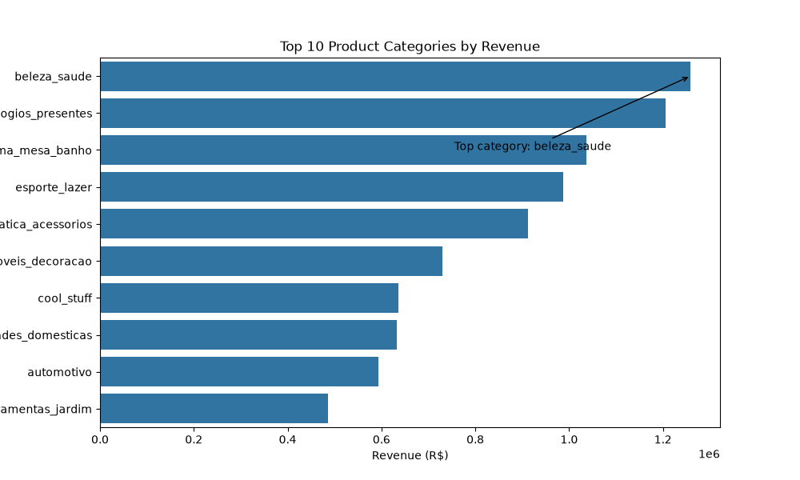
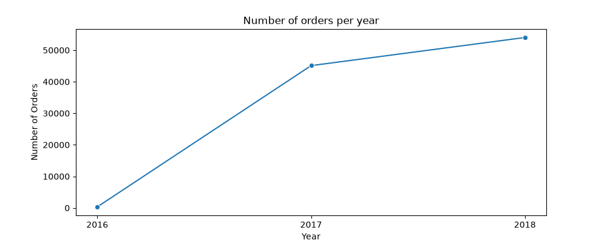
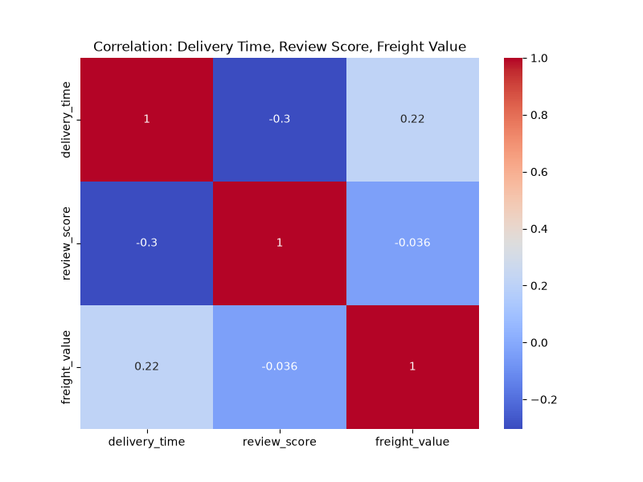
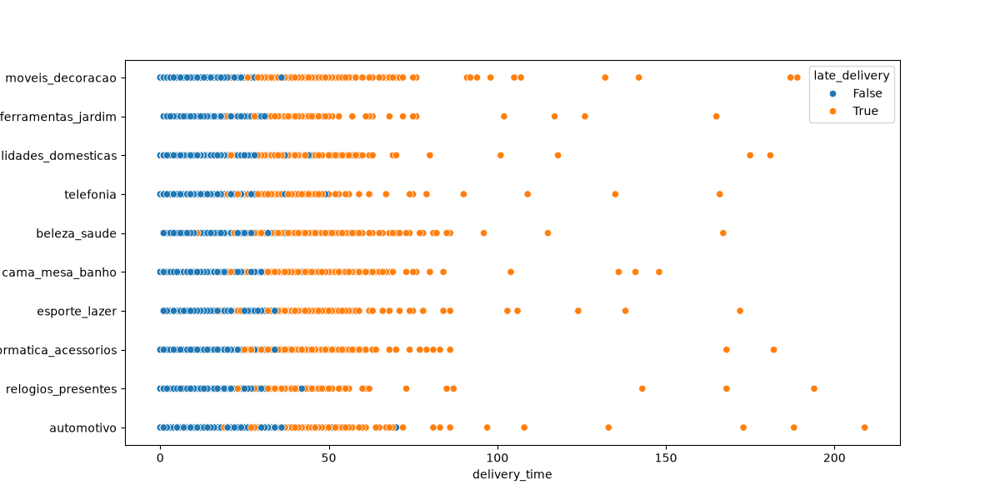
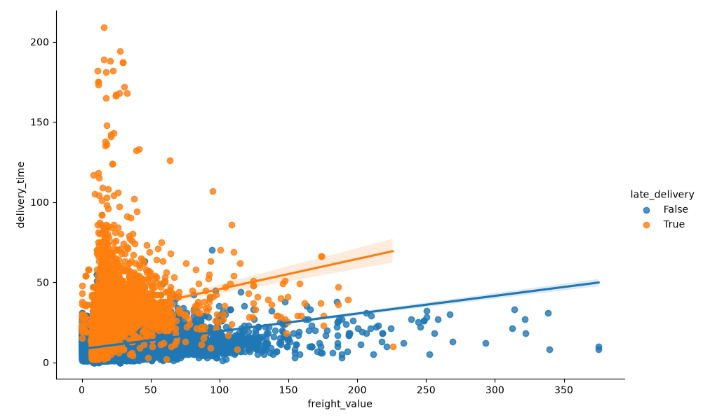
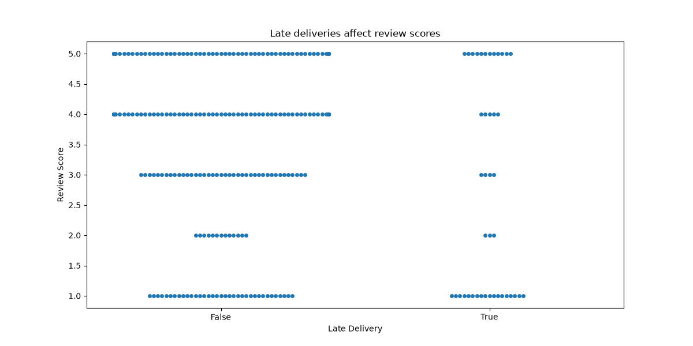
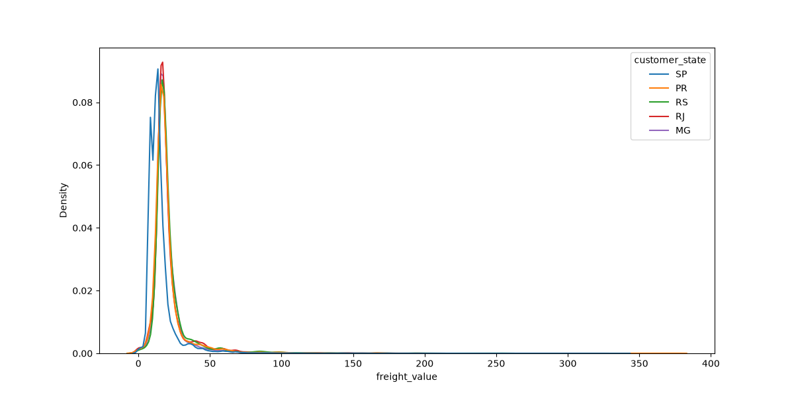
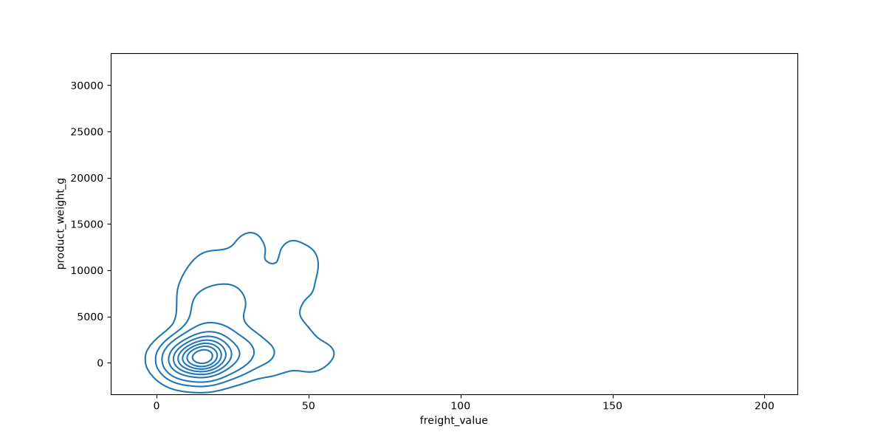

# Week 4 — Data Visualization

## Chart 1: Top Categories
**Question:** Which product categories bring in the most revenue?

## Chart 2: Orders per Year
**Question:** How have order volumes changed year over year?

## Chart 3: Heatmap
**Question:** Does delivery time or shipping cost affect customer review scores?

## Chart 4: Scatterplot
**Question:** Do certain product categories have more late deliveries than others?

## Chart 5: Regplot + Hue
**Question:** Does shipping cost affect delivery time differently for late orders vs on-time orders?

## Chart 6: Swarmplot
**Question:** Do late deliveries actually result in worse review scores, or just a few unhappy outliers?

## Chart 7: KDE + Histogram
**Question:** Does freight cost distribution differ across Brazil's top states?

## Chart 8: 2D KDE
**Question:** Does heavier product weight actually drive up freight cost?
